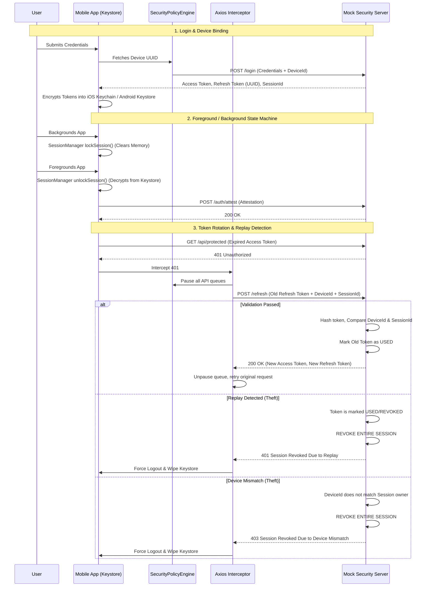

# Enterprise Learning App: Security Architecture


A high-performance, enterprise-grade React Native application demonstrating advanced **Zero-Trust Token Architecture**, **Runtime Application Self-Protection (RASP)**, and **Cryptographic Device Binding**.

---

##  Key Features

- **Runtime Application Self-Protection (RASP)**: Actively monitors device integrity (Root/Jailbreak, Frida Hooking, Debuggers, Emulator usage) and dynamically adjusts risk scores.
- **Zero-Trust Token Rotation**: Mathematical binding of every session to the physical device it was initiated on, preventing token theft and replay attacks.
- **Aggressive Credential Scrubbing**: Redacts sensitive JWTs and UUIDs from memory buffers and Native logs before they reach centralized aggregators (Datadog, Crashlytics).
- **Optimized Asset Pipeline**: 97% reduction in asset payload over the Metro Bundler bridge, ensuring sub-second cold boot and fluid video playback.

---

##  Architecture Workflows

### Token Lifecycle & Replay Detection

Our architecture guarantees **Layer 2 Session Trust** by enforcing single-use refresh tokens and strict device ID validation.



---

##  Security Validation Matrix

To ensure the architectural theory held up to practical exploitation, we built a UI testing suite directly into the application (accessible at the bottom of the Dashboard). All tests pass successfully:

| Test Scenario | Description | Status | Result |
| :--- | :--- | :---: | :--- |
| **Refresh Queueing** | A user makes 3 concurrent API requests right as their Access Token expires. | ✅ | Interceptor securely locks the queue, fires exactly *one* `/refresh`, and transparently replays all pending requests. |
| **Device Mismatch** | An attacker steals an active Session ID & Refresh Token and uses it from a foreign device. | ✅ | Backend detects device ID mismatch, immediately revokes session (`403`), and triggers the kill-chain. |
| **Replay Attack** | An attacker attempts to replay an older (but previously valid) Refresh Token. | ✅ | Backend detects Replay, permanently revokes the *entire* session, and blocks the legitimate user (`401`) to isolate the breach. |
| **Credential Masking** | Prevent raw JWTs and UUIDs from leaking into system logs. | ✅ | `SecurityLogger` successfully intercepts and scrubs sensitive JSON payloads to `[REDACTED]`. |

---

##  Getting Started

### 1. Start the Security Mock Backend

The mock server simulates a robust enterprise authentication backend (handling HMAC, Token Hashes, and Replay State Machines).

```bash
cd mock-security-server
npm install
npm run start:mock
```

### 2. Start the React Native App

```bash
# In a new terminal (root directory)
npm install
npm run start

# Then build the app
npm run android
# or
npm run ios
```
