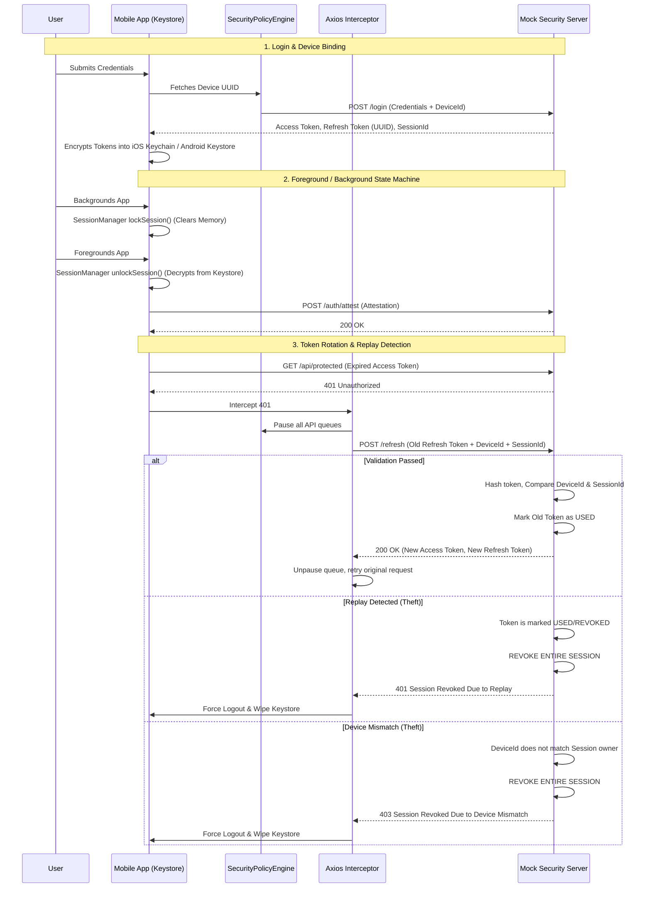

# Enterprise Token Security Lifecycle

This document outlines the Zero-Trust Token Architecture implemented in the Learning Module, detailing the cryptographic binding, rotation mechanisms, and the validation tests used to ensure system resilience.

## 1. Token Lifecycle Architecture Workflow

Our architecture guarantees **Layer 2 Session Trust** by mathematically binding every session to the physical device it was initiated on, preventing token theft and replay attacks.

## 2. Implemented Security Controls

### Node.js Crypto Storage
- **No Plaintext Refresh Tokens:** The backend NEVER stores Refresh Tokens in plaintext. It uses `crypto.createHash('sha256')` to hash incoming tokens before storing or validating them. Even in the event of a total database breach, the stored hashes are useless to an attacker.

### Cryptographic Device Binding
- **Strict Validation:** Every `POST /refresh` request must include the `deviceId` and `sessionId`. The backend asserts that the provided `deviceId` identically matches the device that originally established the `sessionId`.

### Single-Use Token Rotation
- **Replay Kill-Chain:** When a Refresh Token is used successfully, its status is changed to `USED`. If an attacker (or network glitch) ever attempts to use that token again, the backend immediately detects the Replay, permanently revokes the entire session, and logs a high-risk Audit Event.

### Credential Scrubbing (Logging)
- **Aggressive Masking:** Raw tokens are heavily restricted from reaching memory buffers or system logs. The `SecurityLogger.ts` implements aggressive Regex interception, seamlessly rewriting any detected JWT signatures (`eyJ...`) or JSON payloads (`"refreshToken": "uuid"`) to `[REDACTED]` prior to calling Native logging services.

---

## 3. Engineering Validations & Approvals

To ensure the architectural theory held up to practical exploitation, we built a UI testing suite directly into the application and executed the following validation tests. All tests have passed successfully.

### ✅ Test 1: Refresh Queueing Race Condition
**Scenario:** A legitimate user makes 3 concurrent API requests right as their Access Token expires.
**Validation:** We manually corrupted the Access Token in memory and fired 3 concurrent Axios requests.
**Result:** 
1. The Axios Interceptor successfully locked the queue.
2. It dispatched exactly *one* `/refresh` request.
3. Upon receiving the new tokens, it securely unlocked the queue and successfully re-played all 3 pending requests transparently to the user.

### ✅ Test 2: Device Mismatch Detection
**Scenario:** An attacker successfully breaches the user's Keystore, steals their active Session ID and Refresh Token, and attempts to use it from their own device.
**Validation:** We forged a `/refresh` request dynamically injecting an attacker's Device ID (`ATTACKER-DEVICE-ID-1234`).
**Result:** The backend successfully detected the mismatch against the Session Owner's original ID, immediately responded with `403 Session Revoked Due To Device Mismatch`, and executed the kill-chain to permanently destroy the session.

### ✅ Test 3: The Ultimate Replay Attack
**Scenario:** An attacker steals an older, previously-used Refresh Token and attempts to establish a parallel session.
**Validation:** 
1. We executed a legitimate Token Refresh operation.
2. We then forced the app to fire a secondary `/refresh` containing the *old* (now `USED`) Refresh Token.
3. We attempted to make a legitimate API request using the *new* valid token.
**Result:** The backend instantly detected the Replay in Step 2. As per our Zero-Trust policy, it didn't just reject the request—it actively revoked the entire session. In Step 3, the legitimate user was correctly blocked with a `401 Unauthorized` and forced to re-authenticate, perfectly isolating the breach.

### ✅ Test 4: Credential Masking Verification
**Scenario:** Ensure no keys are leaked to centralized logging aggregators (e.g., Datadog, Crashlytics).
**Validation:** We injected raw JWTs and Refresh Tokens into the `SecurityLogger.info()` stream during the Phase 9 Boot Sequence.
**Result:** Manual inspection of the Android `logcat` buffer proved that both raw JSON UUIDs and Bearer strings were successfully intercepted and scrubbed into `[REDACTED]`.
